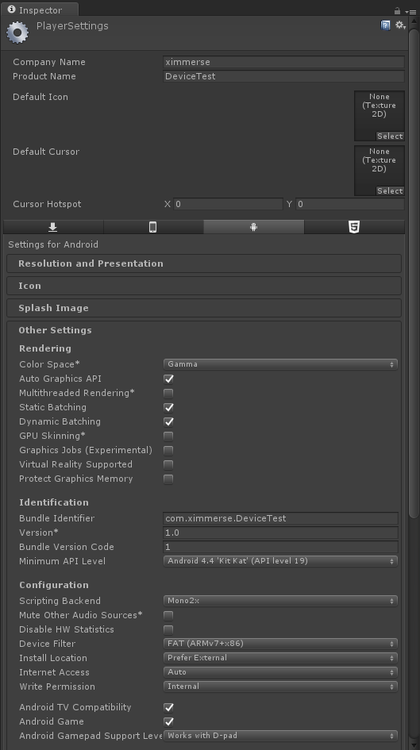

<h1>Flip Controller SDK</h1>
<h3>目录</h3>
<!--toc-->

- [版本记录](#版本记录)
- [名词约定](#名词约定)
- [目录介绍](#目录介绍)
- [按键定义](#按键定义)
- [使用指南](#使用指南)
	- [Android Phone](#android-phone)
		- [1 安装BTConfig工具](#1-安装btconfig工具)
		- [2 手柄配对](#2-手柄配对)
		- [3 运行DeviceTest测试设备](#3-运行devicetest测试设备)
		- [4 演示demo](#4-演示demo)
	- [Window PC](#window-pc)
		- [1 安装蓝牙驱动](#1-安装蓝牙驱动)
		- [2 手柄配对](#2-手柄配对)
		- [3 运行DeviceTest测试设备](#3-运行DeviceTest测试设备)
- [开发指南](#开发指南)
	- [Unity](#unity)
		- [1 开发环境要求](#1-开发环境要求)
		- [2 准备](#2-准备)
		- [3 SDK使用](#3-sdk使用)
		- [4 编程](#4-编程)
	- [Google Cardboard](#google-cardboard)
	- [Google Daydream](#google-daydream)
	- [Windows Natvie C++(TBD)](#windows-natvie-ctbd)
	- [Android Native(TBD)](#android-nativetbd)

<!-- tocstop -->

# 版本记录
版本 | ChangeLOG | 更新日期
---|--- |---
v1.0.1-beta | 增加Flip Controller Unity3D SDK(Android/Win10) 增加Android绑定工具(BTConfig)|2017.03.13

# 名词约定

名称 | 解释
---|---
controller | 手柄
HMD | 头戴显示器，即VR头显
X-Cobra|手柄的别称

# 目录介绍
* **Demo**  	  ：针对主流的HMD，提供演示DEMO
* **Document\Flip** ：说明文档
* **Tools**：工具包  
* **Unity**：Flip Controller Unity SDK  

&emsp;
# 按键定义

>  注：短按'home'键回中

&emsp;
# 使用指南

&emsp;
## Android Phone
步骤：
1) 安装BTConfig工具
2) 手柄配对
3) 安装测试应用体验

### 1 安装BTConfig工具
1.1 在android手机上安装如下两个apk
> - [BTConfig.apk](./../../Tools/BTConfig[1.0.0-Flip].apk): 用于手柄配对的工具
> - [DeviceTest.apk](./../../Demo/DeviceTest.apk)：用于测试设备的工具，可以在手机上输出rotation、button等信息

&emsp;
### 2 手柄配对

2.1 装入电池，手柄自动开机。

2.2 打开手机上的蓝牙功能，并打开BTConfig工具。

2.3 先按下BTConfig的Controller的“Bind”按钮，然后同时按着手柄的'APP'和'HOME'键，配对成功后手柄状态变为"Paired"，退出应用；

> 手柄只需要配对一次；更换新的手柄时，先按BTConfig的"Clear"按键，清除上一次的配对信息，然后重复手柄配对的步骤

&emsp;

### 3 运行DeviceTest测试设备
设备和手机保持连接状态，运行DeviceTest，通过界面可观察到从手柄姿态、按键等信息。

  

&emsp;
### 4 演示demo
名称 | HMD
---|---
[PickCubesDOF3Cardboard.apk](./../../Demo/PickCubesDOF3Cardboard.apk) | Google Cardboard
[Playground for Cardboard.apk](./../../Demo/Playground_for_Cardboard.apk)| Google Cardboard

## Window PC
步骤：
1) 安装蓝牙驱动
2) 手柄配对
3) 运行DeviceTest测试设备
### 1 安装蓝牙驱动
>未带蓝牙的台式机箱，笔记本电脑跳过此步骤

1.1 下载安装CSR Driver [点击这里下载](https://github.com/Ximmerse/SDK/tree/master/Drivers/CSR%20Drivers) 
 
1.2 插入CSR Dongle,设备管理里面将其改为系统蓝牙

1.3 右键点击 更新驱动程序软件

1.4 点击 浏览计算机

1.5 点击 从计算机的设备驱动列表中选取

&emsp;

1.6 选择 Generic Bluetooth Adapter 点击 下一步  windows状态栏出现蓝牙功能
### 2 手柄配对
打开系统蓝牙界面，打开手柄，配对手柄

&emsp;

### 3 运行DeviceTest测试设备
电脑和手柄保持连接状态，运行DeviceTest[v1.0.0-beta].exe，通过界面可观察到从手柄姿态、按键等信息

  

&emsp;

&emsp;
# 开发指南

## Unity

### 1 开发环境要求
名称 | 要求
---|---
Operating System  |Windows 10 Mac OSX >= 10.7.5
Bluetooth LE Dongle| 支持4.0 BLE 蓝牙适配器
Unity3D引擎|5.4以上版本
Apple XCode|TBD
Google Android Studio|TBD

### 2 准备
1) 参考<使用指南>，安装平台的运行环境
2) 下载[Unity SDK Plugin for Flip Controller](https://github.com/Ximmerse/SDK_Flip/tree/master/Unity)

### 3 SDK使用
1) 建立新的Unity3D project, 点击如下按钮：
> Assets -> Import -> Package -> Custom Package

选择将下载的"Unity SDK Plugin for Flip Controller"导入

  

&emsp;

2) 点击如下按钮，选择DeviceTest场景：
> Assets -> Ximmerse SDK -> DemoScenes -> 01 - Device Test

  
&emsp;

3) 编译DeviceTest Demo，这里以Android平台为例
- 1. 切换发布平台：
> Files -> Build Setting -> 选择平台 -> Switch Platform

  
&emsp;

- 2.设置
> 选择“Player Setting”按钮，将API Level设置为19

  

&emsp;

- 3.选择“Build”,编译DeviceTest应用，运行测试

### 4 编程
1) 脚本说明
	- XDevicePlugin
	  >Unity和native之间的通信桥梁 
	  >注意：通常这个类在引擎中没有直接使用，因为这个类的数据是原始数据，必须进一步计算才能正确使用。 
	  >Namespace 
	  >Ximmerse.InputSystem 
	- ControllerInput
	  >包含控制器信息，如按钮状态、原始位置、原始旋转等 
	  >Namespace 
	  >Ximmerse.InputSystem 
	- TrackedObject
	  >在VR中绑定控制器，获取并使用手柄的IMU等信息 	
	- TrackedHead
	  >继承TrackedObject，在VR中绑定Head anchor,获得并使用HMD头部数据 
	- ControllerInputManager
	  >单例，初始化所有的controllerinput，管理controllerinput 
	  >Namespace 
	  >Ximmerse.InputSystem 
	- DeviceStatus
	  >获取并使用输入设备的状态，如连接状态电量等信息
2) Buttons
	- controllerInput.GetButton(ControllerButton buttonMask) //按键一直按住
	- controllerInput.GetButtonDown(ControllerButton buttonMask) //按键按下
	- controllerInput.GetButtonUp(ControllerButton buttonMask) //按键抬起
3) touchPos
	- controllerInput.touchPos
4) Rotation
	- controllerInput.GetRotation()
5) Accelerometer
	- controllerInput.GetAccelerometer()
6) Gyroscope
	- controllerInput.GetGyroscope()
7) Battery
	- controllerInput.batteryLevel
8) connectionState
	- controllerInput.connectionState
9) Recenter
	- controllerInput.Recenter()

## Google Cardboard
1) 建立新的Unity3D project, 导入unitypackage
	> Assets -> Import -> Package -> Custom Package 选择Flip-v1.0.0-beta-0313.unitypackage
2) 下载并导入Google VR unitypackage
	> Assets -> Import -> Package -> Custom Package 选择GoogleVRForUnity.unitypackage
3) 编译PickCubes demo
	> Files -> Build Setting -> 选择平台Android -> Switch Platform
4) 设置	
	> Files -> Build Setting -> Player Settings 填写Bundle Identifier，选择Minimum API Level为API level 19 
	

	
	
  
	&emsp;
5) 导出
	> 连接手机，点击Build And Run
## Google Daydream
	    3DOF手柄完全兼容Daydream平台，只需用上述蓝牙配对工具配对好手柄，就可以用手柄控制Dayderam的应用；
	所以在开发Daydream应用的时候只需按照Google的方法和流程进行开发，无需导入我们的package
1) 下载Unity Technical Preview For Daydream  [点击这里下载](https://unity3d.com/cn/partners/google/daydream)
2) 建立新的Unity3D project, 下载并导入Google VR unitypackage
	> Assets -> Import -> Package -> Custom Package 选择GoogleVRForUnity.unitypackage
3) 编译gvr demo
	> Files -> Build Setting -> 选择平台Android -> Switch Platform
4) 设置	
	> Files -> Build Setting -> Player Settings 勾选Virtual Reality Supported,添加Daydream；填写Bundle Identifier
5) 导出
	> 连接手机，点击Build And Run
## Windows Natvie C++(TBD)
## Android Native(TBD)
